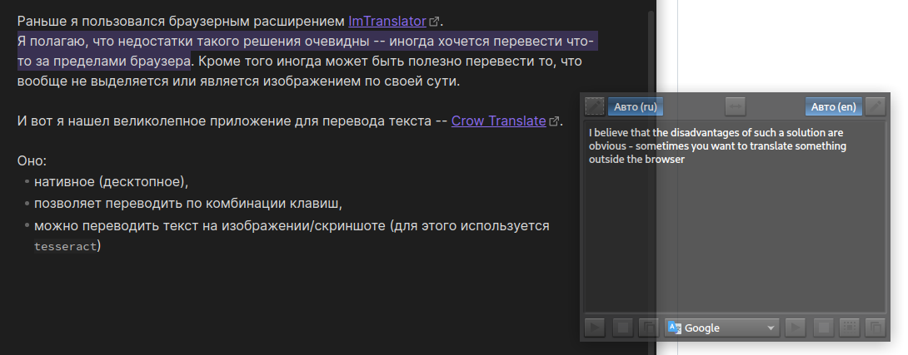
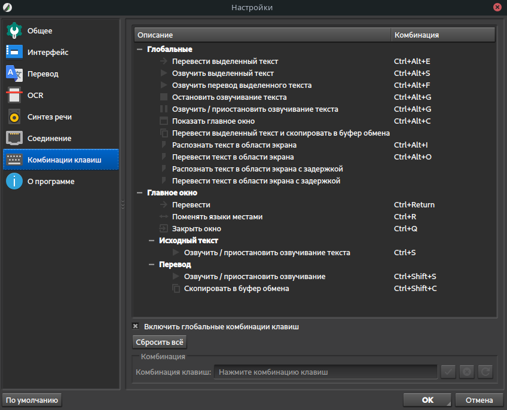

# Crow Translate

Раньше я пользовался браузерным расширением [ImTranslator](https://addons.mozilla.org/ru/firefox/addon/imtranslator/).
Я полагаю, что недостатки такого решения очевидны -- иногда хочется перевести что-то за пределами браузера. Кроме того иногда может быть полезно перевести то, что вообще не выделяется или является изображением по своей сути.

И вот я нашел великолепное приложение для перевода текста -- [Crow Translate](https://github.com/crow-translate/crow-translate).

Оно: 
 - нативное (десктопное),
 - позволяет переводить по комбинации клавиш,
 - можно переводить текст на изображении/скриншоте (для этого используется `tesseract`)

## Скриншоты

